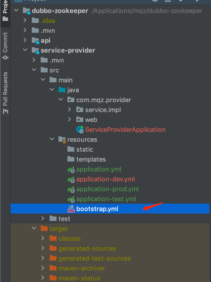
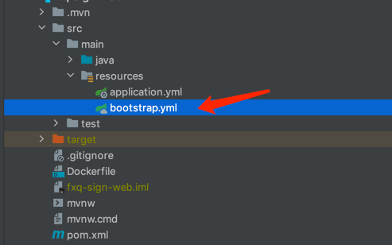

# Dubbo + Zookeeper
    1.provider: service-provider
        定义服务接口
        注入服务实现类，实现定义的接口

    2.consumer: web-consumer
        引用服务接口
    
    3.applicaiton-monitor : web服务监控系统
    
    - 项目均依赖基础项目 mars （https://github.com/DemoMeng/mars）

### springboot 扫描不到 bootstrap.yml

    注意： 一般单独使用 Spring Boot 时，bootstrap.yml 文件一般是不会生效的，也就是没有 小绿叶 图标；
          如果使用了 Spring Cloud 组件 bootstrap.yml 才会生效，需要引入 spring-cloud-commons-dependencies 这个包依赖（或者是使用了springCloud的一个组件，如Eureka、Feign等他们都有这个依赖）。 
          另外 bootstrap.yml 的加载顺序优先于 application.yml。

    - bootstrap.yml (bootstrap.properties) 、 application.yml (application.properties)二者加载关系
      *  bootstrap.yml（bootstrap.properties）用来在程序引导时执行，应用于更加早期配置信息读取，如可以使用来配置application.yml中使用到参数等
      *  application.yml（application.properties) 应用程序特有配置信息，可以用来配置后续各个模块中需使用的公共参数等。
      *  bootstrap.yml 先于 application.yml 加载

    - bootstrap.yml 的使用场景：
      * 1.SpringCloud项目中， 需要在bootstrap.yml中配置配置中心地址（参考 https://github.com/DemoMeng/nacos-consumer-a）
      
    - bootstrap.yml 加载：
        
        父级：SpringApplicationContext -- > 加载 bootstrap文件 
        子级：ApplicationContext -- >  加载application文件
        
        原因： 当使用 Spring Cloud 的时候，配置信息一般是从 config server 加载的，为了取得配置信息（比如密码等），
              需要一些提早的引导配置。因此，把 config server 信息放在 bootstrap.yml，用来加载在这个时期真正需要的配置信息
