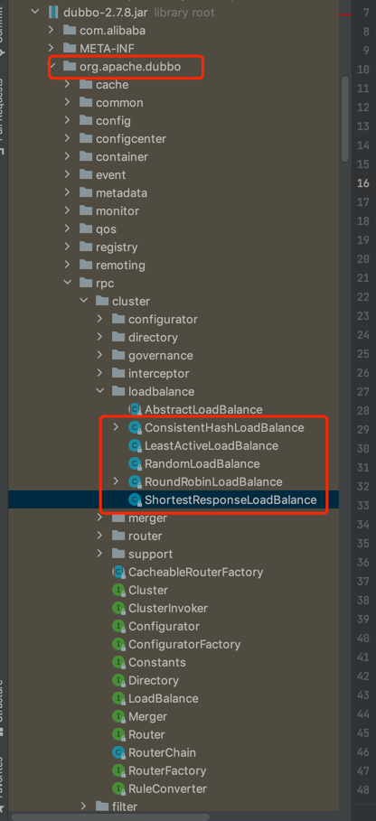
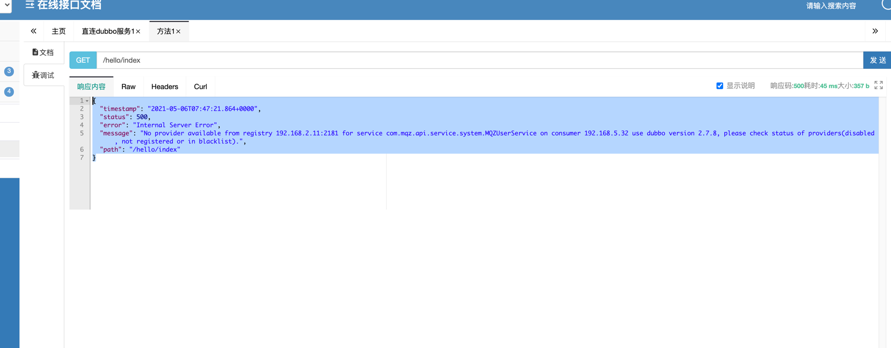

# 服务提供方

    1. 依赖公共api

    2. 启动类上加上注解：
       @EnableDubbo//开启dubbo
       @DubboComponentScan(basePackages = {"com.mqz.provider"})//dubbo组件基础包路径
    3. 公共api接口实现类加上 @DubboService 申明提供服务

# dubbo负载均衡策略：
    源码：

    关键字：
        consistenthash
        leastactive
        random
        roundrobin
        shortestresponse

    使用： 
        1.服务端     @DubboService(loadbalance = "")
        2.服务端方法：@Method(loadbalance="")
        3.调用者：   @DubboReference(loadbalance="")  
        4.调用者方法：@Method(loadbalance="")

    具体：
        Random LoadBalance ： （默认/缺省），随机
            - 按权重设置随机概率。
            - 在一个截面上碰撞的概率高，但调用量越大分布越均匀，而且按概率使用权重后也比较均匀，有利于动态调整提供者权重。

        roundrobin：轮询
            - 按公约后的权重设置轮询比率。
            - 存在慢的提供者累积请求的问题，比如：第二台机器很慢，但没挂，当请求调到第二台时就卡在那，久而久之，所有请求都卡在调到第二台上。

        leastactive：最少活跃调用数
            - 相同活跃数的随机，活跃数指调用前后计数差。
            - 使慢的提供者收到更少请求，因为越慢的提供者的调用前后计数差会越大。

        consistenthash：一致性 Hash
            - 相同参数的请求总是发到同一提供者。
            - 当某一台提供者挂时，原本发往该提供者的请求，基于虚拟节点，平摊到其它提供者，不会引起剧烈变动。
            - 算法参见：http://en.wikipedia.org/wiki/Consistent_hashing
            - 缺省只对第一个参数 Hash，如果要修改，请配置 <dubbo:parameter key="hash.arguments" value="0,1" />
            - 缺省用 160 份虚拟节点，如果要修改，请配置 <dubbo:parameter key="hash.nodes" value="320" />

# 指定dubbo的版本：

    1.服务方： @DubboService(version="0.1")
        不同的版本，可以新建不同的实现类！！
    
    2.调用方： @DubboReference(version="0.1")

    问题：如果服务方指定了服务的版本，但是调用方没有指定，则会报错：No provider available ！

